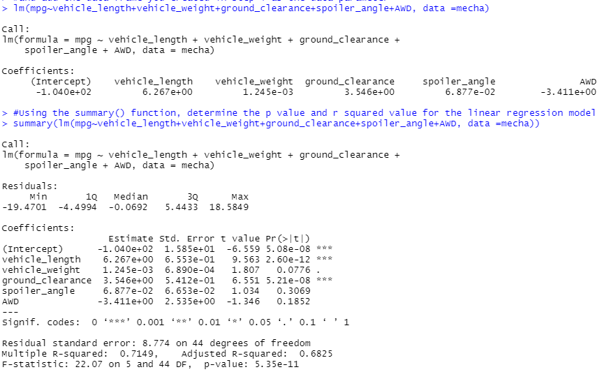
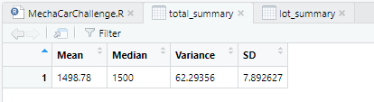
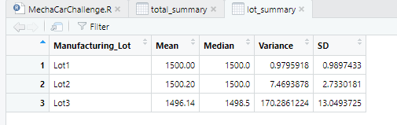
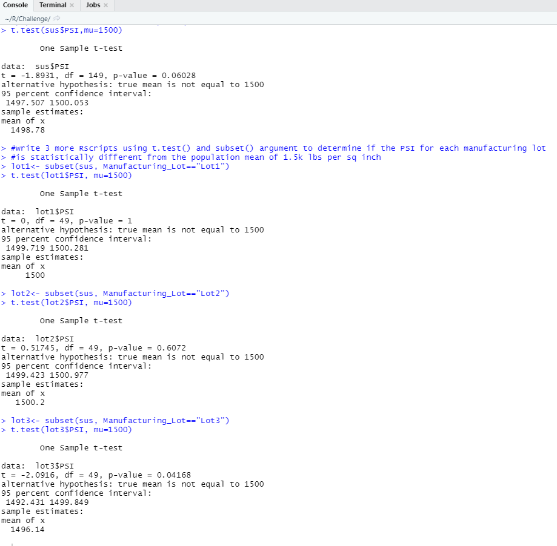

# MechaCar_Statistical_Analysis

## Overview of Project

### Purpose

The purpose of this analysis is to perform analytics over MechaCar production data and arrive at conclusions that may help the business.

## Linear Regression to Predict MPG

**Which variables/coefficients provided a non-random amount of variance to the mpg values in the dataset?**

Vehicle length and ground clearance

**Is the slope of the linear model considered to be zero? Why or why not?**

No. The p-value indicates statistical significance. 

**Does this linear model predict mpg of MechaCar prototypes effectively? Why or why not?**

Yes because there's a strong correlation for this linear model as the R-squared value depicts.

## Summary Statistics on Suspension Coils

**The design specifications for the MechaCar suspension coils dictate that the variance of the suspension coils must not exceed 100 pounds per square inch. Does the current manufacturing data meet this design specification for all manufacturing lots in total and each lot individually? Why or why not?**

Total summary indicates that the manufacturing lots in total does meet design specifications because it's symmetrically distributed with an acceptable variance and small SD

Lot summary indicates that Lots 1,2 meet the design specifications, but Lot 3 appears to have a much larger variance and high standard deviation 

## T-Tests on Suspension Coils 

All of the T-tests, both all together, and for individual lots, indicate a P-value that is higher than 5%, signifying that it is not statistically significant and as such we cannot reject the null hypothesis 

## Study Design: MechaCar vs Competition

I'm not too familiar with cars to be honest, but horsepower seems to be an important aspect in deciding to purchase. A null hypothesis could be, horsepower of the car does not have an impact on how fast a car goes from O to 60 MPH. The Ha would be horsepower of the car does impact how fast a car gets from 0 to 60 MPH. This could be analyzed by looking at correlation and perhaps ANOVA. Testing for statistical significance can help consumers decide whether horsepower should be considered when they want to accelerate really fast on the road ( I assume it would be). In terms of data needed, obviously horsepower of the car and also data on how many seconds it takes for the car to go from 0 to 60. 

